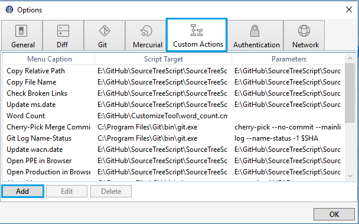
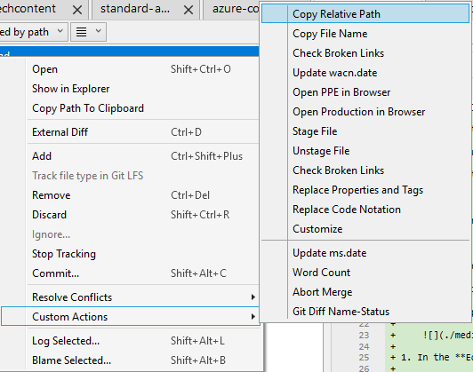
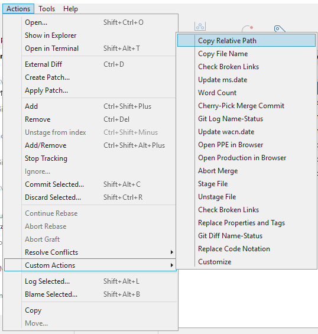
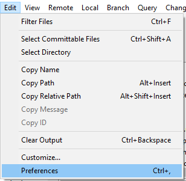
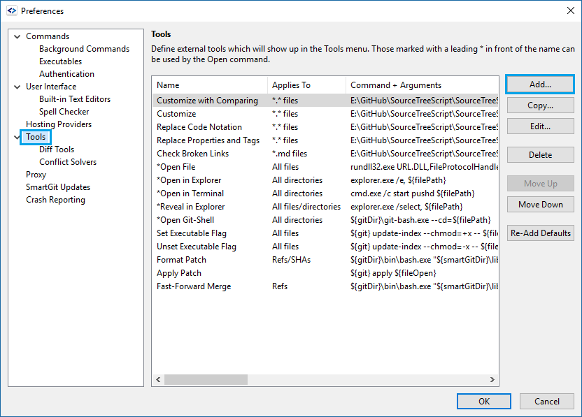
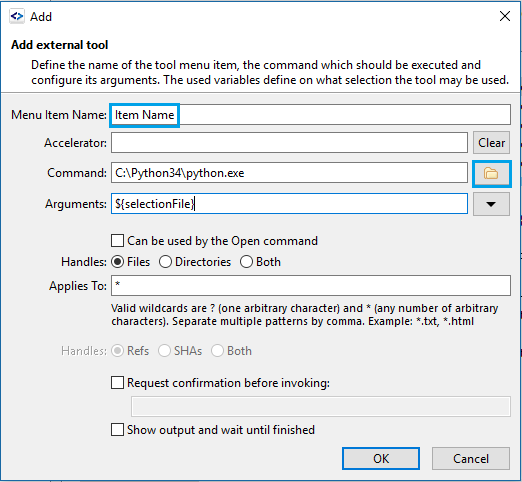
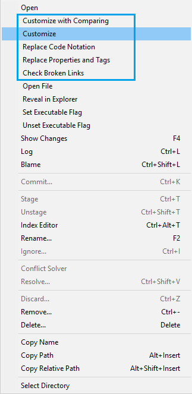
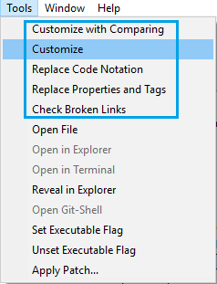

# Source Tree Script

This is a project of some commonlly used tools in Source Tree or SmartGit for Mooncake Content Team.

## Prerequisite

1. Install Source Tree or SmartGit.

1. Install Python 3.5.

1. Use pip to install the requirements.

        pip install -r requirements.txt

## How to add Custom Actions in Source Tree

1. Open Source Tree, and click **Tools** > **Options** in the tool bar.

    

1. In the **Options** popup, click **Custom Actions** > **Add**.

    

1. In the **Edit Custom Action** popup, enter a meaningful name for your custom action. Check **Open in a separate window** and **Show Full Output**.

    

    > **Note**: The **Open in a separate window** is highly recommended, because it allows your to run multiple action at the same time.

1. Click **"..."** to choose the python executable. It's located at "C:/python34/" by default for Python 3.4.

1. Enter the Parameters for your custom action, and click **OK** to save the Custom Action.

1. After you have added the custom action, you can find it by right clicking a file or a commit, and choose **Custom Aciotns**

    

    > **Note**: After the Custom Action is being added, you need to reopn your repo to see the action in the menu.

1. Or, click **Aciotns** in the tool bar, and choose **Custom Aciotns**

    

## How to add Custom Tools in SmartGit

1. Open SmartGit, and click **Edit** > **Preferences** in the tool bar.

    

1. In the **Preferences** popup, click **Tools** > **Add...**

    

1. In the **Add** popup, enter enter a meaningful name for your custom action, and check **Show output and wait until finished** if you need to see the output of the action.

    

    > **Note**: The **Show output and wait until finished** option is different from Source Tree, if you need the output in SmartGit, you have to wait until finished. Furthormore, if the output is to long, SmartGit cannot display it all.

1. Choose the Python executable, and enter arguments for it. Click **OK** to save the custom tool.

1. After the custom tool is added, you can find it by right clicking a file.

    

1. Or, Click **Tools** in the tool bar.

    

## Tools that have been implemented

### Copy relative path of a file

This action is for Souce Tree, because SmartGit has already had a build-in action that doed this thing.

Parameters:

    /path/to/SourceTreeScript/SourceTreeScript/SourceTreeScript.py copy_relative_path $FILE

### Copy the name of a file

This action is for Souce Tree, because SmartGit has already had a build-in action that doed this thing.

Parameters:

    /path/to/SourceTreeScript/SourceTreeScript/SourceTreeScript.py copy_relative_name $FILE

### Check broken link for a file

Source Tree:

    /path/to/SourceTreeScript/SourceTreeScript/SourceTreeScript.py check_broken_link $REPO/$FILE /path/to/techcontent/

SmartGit:

    /path/to/SourceTreeScript/SourceTreeScript/SourceTreeScript.py check_broken_link ${filePath} /path/to/techcontent/

> **Note**: Be aware that `/path/to/techcontent/` must be ended with "/".

### Update ms.date for all article

Source Tree and SmartGit:

    /path/to/SourceTreeScript/SourceTreeScript/SourceTreeScript.py replace_date /path/to/azure-content-pr/ /path/to/techcontent/

> **Note**: Be aware that `/path/to/techcontent/` and `/path/to/azure-content-pr/` must be ended with "/".

### Update wacn.date for the selected files

Source Tree:

    /path/to/SourceTreeScript/SourceTreeScript/SourceTreeScript.py update_wacn_date --today $REPO $FILE

SmartGit:

    /path/to/SourceTreeScript/SourceTreeScript/SourceTreeScript.py update_wacn_date_smartgit --today ${selectionFile}

> **Note**: This tool updates the wacn.date to be today for the selected files. If you want to update it to be a specific date, just replace `--today` by the date you want.

### Open the PPE page of an article in the default web browser

Source Tree:

    /path/to/SourceTreeScript/SourceTreeScript/SourceTreeScript.py open_ppe_in_browser $FILE

SmartGit:

    /path/to/SourceTreeScript/SourceTreeScript/SourceTreeScript.py open_ppe_in_browser ${filePath}

### Open the production page of an article in the default web browser

Source Tree:

    /path/to/SourceTreeScript/SourceTreeScript/SourceTreeScript.py open_production_in_browser $FILE

SmartGit:

    /path/to/SourceTreeScript/SourceTreeScript/SourceTreeScript.py open_production_in_browser ${filePath}

### check broken link for the selected files

Source Tree:

    /path/to/SourceTreeScript/SourceTreeScript/SourceTreeScript.py check_broken_link_multiple /path/to/techcontent/ $REPO $FILE

SmartGit:

    /path/to/SourceTreeScript/SourceTreeScript/SourceTreeScript.py check_broken_link_multiple_smartgit /path/to/techcontent/ ${selectionFile}

> **Note**: Be aware that `/path/to/techcontent/` must be ended with "/".

### Roll back the new properties and tags for the selected files

Source Tree:

    /path/to/SourceTreeScript/SourceTreeScript/SourceTreeScript.py replace_properties_and_tags $REPO $FILE

SmartGit:

    /path/to/SourceTreeScript/SourceTreeScript/SourceTreeScript.py replace_properties_and_tags_smartgit ${selectionFile}

### Replace the "```" code notation with the leading empty spaces one for the selected files

Source Tree:

    /path/to/SourceTreeScript/SourceTreeScript/SourceTreeScript.py replace_code_notation $REPO $FILE

SmartGit:

    /path/to/SourceTreeScript/SourceTreeScript/SourceTreeScript.py replace_code_notation_smartgit ${selectionFile}

### Customize files without comparing with the old customization

Source Tree:

    /path/to/SourceTreeScript/SourceTreeScript/SourceTreeScript.py customize_files $REPO $FILE

SmartGit:

    /path/to/SourceTreeScript/SourceTreeScript/SourceTreeScript.py customize_files_smartgit ${selectionFile} ${repositoryRootPath}

### Customize files by comparing with the old customization

Source Tree:

    /path/to/SourceTreeScript/SourceTreeScript/SourceTreeScript.py customize_files_compare $REPO /path/to/azure-content-mooncake-pr $FILE

SmartGit:

    /path/to/SourceTreeScript/SourceTreeScript/SourceTreeScript.py customize_files_compare_smartgit ${repositoryRootPath} /path/to/azure-content-mooncake-pr ${selectionFile}

> **Note**: In order to use this tool, you need to be carefull with the following few things.
>
> 1. This tool must be run for the Acom repo. And, within the Acom repo, there are must be a branch named "lastmonthcustomized" whose files are customized with the previous 3 tools.
>
> 1. The differences between mooncake-pr and the branch "lastmonthcustomized" of Acom must be the customization you have done to the file. No more no less, not even a new line or an empty space.
>
> 1. Be careful with adding contents into an article, because I have no idea with where the contents will be added after the tool is run, if the article is changed a lot.

### PanTool for multiple files

Source Tree:

    /path/to/SourceTreeScript/SourceTreeScript/SourceTreeScript.py pantool $REPO $FILE

SmartGit:

    /path/to/SourceTreeScript/SourceTreeScript/SourceTreeScript.py pantool_smartgit ${repositoryRootPath} ${selectionFile}

### Replace OPS external code

Source Tree:

    /path/to/SourceTreeScript/SourceTreeScript/SourceTreeScript.py replace_script $REPO /path/to/azure-docs-cli-python-samples/ /path/to/azure-docs-powershell-samples/ $FILE

SmartGit:

    /path/to/SourceTreeScript/SourceTreeScript/SourceTreeScript.py replace_script_smartgit ${repositoryRootPath} /path/to/azure-docs-cli-python-samples/ /path/to/azure-docs-powershell-samples/ ${selectionFile}